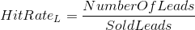
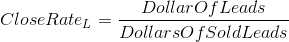
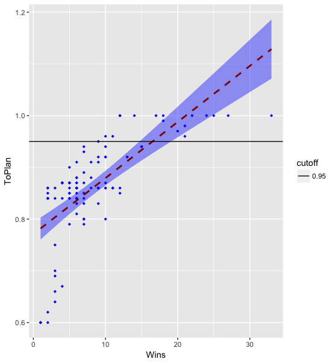

## Data Science in the B2B Sales Operations Domain

This document seeks to describe how methods in statistics, machine learning and the overall broad definition of Data Science can help companies get the most out of one of the most underrated levers that a company has in their tool belt.

We do this by taking a look at a broad definition of what Sales Operations is. We also look at a couple of basic metrics. Finally, we start to explore methods in which we can deploy Data Science to Sales Operations. This document is not an entire Sales Operations Charter, I bet we could write one well over 100 pages for a large company. I'll update this document as I have time to do so with additional modeling techniques that can be used.

So, what makes me qualified to write about this subject? Most of my career now has been spent in an outside sales role and as a Sales Operations professional. In 2017, I started a Data Science graduate program for my Master’s. I’ll be finished up August of 2018. I started to apply time series to forecasting (thanks OU Econ department for offering an undergrad course in Forecasting) sales results in one of my positions and that led me to exploring what advanced analytics could do for large business to business sales teams. These analysis and others have helped move sales forces millions of dollars in the right direction. Now into my graduate program, I have seen that basic modeling can do a lot to not only find out what is happening, what can happen, but can also improve the effectiveness of a large B2B sales team.

### What is Sales Operations

Sales Operations, I often tell people is the department that does all the nasty number stuff that nobody else wants to do, but has to be done in order to makes sales teams great.  Sales Operations, or Sales Ops is both an art, and a science. The very concept of Sales Operations as we understand it was born out of one of the greatest sales companies in the 20th century, Xerox. Xerox brought what we now know as Sales Operations in the 1970's [ HBR ](https://hbr.org/2014/12/why-sales-ops-is-so-hard-to-get-right). Now most growing companies from start-ups to multi-national enterprise corporations have a Sales Operations Department.

If we want to define Sales Operations more formally here is what I would say:
Sales Operations is the department that guides your internal departments, think finance, marketing, human resources (HR), ect to help build a world class sales organization through processes, systems and analysis of the company's revenue generation strategy.

### Basic Pillars of Sales Operations

Sales Operations Departments typically have various units within a department they include in no particular order:

#### Sales Planning and Compensation 

This area of Sales Operations is sometimes owned by Finance, or HR in some organizations. It is my personal recommendation that unit stay within Sales Operations with guidance from finance, HR and, get this, marketing.  Yes, marketing, more about that later. Sales Ops' ear is always on the ground listening to sales professionals, managers, and executive leadership.  They know what capacity the sales force has to take on additional revenue plans.  

If we need to take on additional growth (this happens when we fail to meet to a revenue growth number from an agreed upon strategy plan) your Sales Ops department can point to what geographic areas, industry verticals, ect can take the growth rather than just an even distribution. You see this is getting hairy, this is why you need a team of finance to make everyone understand the why, marketing to help understand the where, HR to understand the what and Sales Ops to understand the how.

#### Sales Analytics

To me, sales analytics is the backbone to all great sales operations departments, not just because it was my transition from sales professional to Sales Ops, but sales analytics feeds every one of your pillars in Sales Ops. This area works very close with finance to figure out what we forecast turns into actual revenue and how that revenue flows into the financials. Sales analytics also works closely with the people who operate the business to see how many cogs need to be produced and what kind of cogs we are selling.  Guess who else works close with your Sales Analytics? You guessed it, I hope, it's marketing (I hope you are seeing a trend here). Sales Analytics also provides the direction of what happens if we do x or y strategy from Marketing.  They also find out what happened so we don't repeat that one quarter of which we never speak of again.

This pillar also sets the direction of your reporting that drives execution. Your analytics leadership should be in on strategy discussions from the start to better support what metrics are going to be used and what methods and Business Intelligence tools will be utilized to distribute the reporting.

Your analytics leadership and personnel need to be versed in statistics, quick analysis, information technology and I would recommend the following programs and or languages at the very basic level:

SQL and relational databases
R through R Studio
Excel
Power BI or Tableau

#### Administration

Often overlooked by people in Sales Ops and definitely in other departments, this department glues together everything. Often the people who get their hands dirty in request for pricing (RFP) helping sales professionals win what is called "Green Grass", or new business. Guess what else lives in area in some companies, yeah, get ready it’s a lot:
Procurement, CRM oversight, budget, sales support and new objects to juggle from sales professionals, Sales Ops, finance, operations, marketing, HR, ect.

Administration handles a lot, and can sometimes become a dumping ground, so oversight is very important to make sure the work load is focused on making the revenue plan. Many people are surprised when I tell them about a typical budget for a sales team. There is a lot going on. You have sales resources traveling, going to events, getting trinkets, buying lunches, ect. You have department wide expenses such as season tickets, kick-off events, ect.

Sales support is often the most overlooked, some of it can be automated with a good CRM, sales enablement (more on this), but you need a good ratio of Sales Ops professionals to your sales professionals. In our current age of data available your customers demand their data, and yes you can give it to them, but you also need to be careful, so your sales professionals and sales support need to be strategic on how their data is presented to them.  Guess who helps with this? Marketing!!

#### Sales Enablement

This area of sales operations is fairly new, but like all of the pillars, very important. Your CRM system and applications that support it are vital to not only the Sales Ops department, your other departments, but most importantly, it keeps your sales people from becoming data entry clerks. 

Sales enablement contains your CRM experts, sales trainers, sales process strategy, and communications experts. That is a lot going on, could almost be a department of HR couldn't it? In some organizations, it is. Try not to let that happen.  Keep Sales Enablement close to the tip of the sales spear. This department needs close partnership to your information technology (IT) for infrastructure needed for the CRM, sales professional facing applications, ect. 

An outside company is never going to better at training your sales resources as in-house trainers can be. Ride alongs are a must, no matter the cost. You need your sales professionals following the process all the time. Your Sales Ops professionals and those from other departments that support sales need to sit in sales training with sales professionals. You will be surprised how good your data people are at "Standing and Delivering" in sales training.

### Ending our Sales Ops 101

Now, this list is not everything by no means. It can take months to design a Sales Ops strategy and take a year or two to perfect the org chart that fits your company and industry. Hopefully this takes some people aback and really lets them see all of the art, process and execution that goes into Sales Operations.

## The Science in Sales Operations

First and foremost, sales is a numbers game, we can take this back to the classic sales funnel. A sales funnel is well a funnel. We have various layers to this funnel. Not every opportunity is going to come out of the funnel, and sometimes, our organizations could not handle every opportunity coming out of that funnel, but Sales Ops needs to keep the right amount coming out of it to make business plan in terms of revenue and profit. So, let's start with a simple sales funnel.

At the top is where leads are poured into it. This is often called the top of the funnel. Most of the time these leads come from our partners in marketing. Leads are hopefully scored and have gone through some sort of validation before this point (so there is another level of the funnel? Yes, yes there is, that is another document in of itself).

#### Sales Stages Through the Funnel
Let’s say we get 100 leads from our partners in marketing. We then deploy through a CRM system like Salesforce, Microsoft Dynamics, ect to our sales professionals. They were scored very well and we get 60 of those into a sales stage called Prospecting. In Prospecting from our partners from Sales Enablement we learn that this stage is used to research and quantify our opportunity to service these 60 potential accounts. From there 30 make it to stage called Preparation, where we prepare a pitch for the customer and start to set up meetings where we try and improve or disrupt their current process. Out of that, after digging deeper into customer needs we end up with 20 that we can pitch our solutions to.

In our pitches we find more information that disqualifies the deals for some reason (customer in contract with competitor until 2021, switching to platform we don't support, ect) we are down to 15. Out of the 15, 5 agree to enter into contract negotiations, putting us in a new stage of Consideration. This gets us 4, that’s right 4 of these 100 opportunities agree to go through an implementation and give us money for our product. Doing some quick napkin math that puts our hit rate on opportunities at 4%. That brings us to our first basic sales metric:

 

There is also what is called a Close Rate and that looks dollars signed and can deviate from the hit rate.

 

Now, you are saying well that was easy. Yes, it was, but if you have any sense of problem solving or process improvement you want to rip into what happened in those 100 leads and what that can teach us. How do we improve that 4% hit rate to a 10% or even 50% hit rate. Why would we want to do this?

Each of those deals on average gained us an additional 100K per year at 20% profit margin. So, a hit rate of 20% of would have netted us an additional 1.6 million in revenue, you can do the math for the rest of hit rates yourself to see what impact those improved hit rates have.

Notice we did not talk about one of the most important aspects of sales strategy and that is time. How long did it take for us to get from Marketing pouring leads into our funnel and getting to close. For simplicity it took 120 days, or an entire quarter. Now, depending on your product that can be good or it can be slow. Sales Ops always wants to make speed to revenue as short as possible for both customer satisfaction, but also for sales professional satisfaction. This brings us into another metric:

Where our TimeQuotaint is our quotiant of:

 

In this case we had 4 opportunities at a mean opportunity value of 100K this puts our Amount in the Funnel at 4 times 100K or 400K divided by our Time Quotient of .34 tell us that we can generate 1.18 Million per year at that 4% hit rate. This tells us that we turn this funnel 3 times in a year.

Again, we have to ask ourselves can we improve the time to get more turns in the funnel? What about dropping to 90 days, that gives us about 1 more turn. What about 60 days? Add that to a higher hit rate we can really start doing some damage to that sales plan in a very good way.

Remember that part a few paragraphs up where I mentioned sales rep satisfaction? Sales resource retention is as important as your overall retention strategy. If you have sales positions that are revolving doors those positions are not going to generate revenue for a while. Just think about how long some sales academies are. Some are 6 weeks long. So, you have a rep that gets on boarded in a week, then leaves for 6 weeks typically in another city, so your company is paying for airfare and hotel. The number you are not calculating is how much opportunity cost you are leaving in that territory with partial coverage. If your average rep’s sales goal is 1 million dollars per year, at 252 days that’s 4K dollars per day, or around $400 dollars per hour based on a ten-hour work day. 

Now imagine you have an open territory for an entire quarter. You may have partial coverage, but partial coverage never results in what a full-time sales resource could do in that territory.

### How does Data Science fit into this

One area where I have seen success is looking at classification methods for deals that will close and those that may not. Classification methods that drive a decision of binary classification such as logistic regression, Support Vector Machines, Nearest Neighbors, Bayesian Classifications, Decision Trees and Artificial Neural Networks can help us decide what deals may close and those that will not. Once of the few papers on B2B sales and machine learning was written by some employees of IBM, it’s worth checking out here [ Classification Paper ](https://arxiv.org/pdf/1502.06229.pdf).

Some lessons I have learned is that you need to find more dimensions to your deals that are more than just what industry, what sales segment, product, ect. You are going to need to look at time between stages, customer revenue size, contract start and end dates, sales resource metrics. It can take hours or even days to produce a schema for a data mart where we can mine information out of regularly. 

An area I would like to do further research on is in Natural Language Processing (NLP) to look at deal health, sales professional retention, and product strategy through the information contained within CRM, call center, and customer stratification surveys to tell us more about sales resources, our products and services.

#### Classification methods to help determine which sales professionals make plan

At the end of the day our ultimate goal as professionals in Sales Operations is to make the sales plan. The sales plan bascially how much in signed sales we need in order to make our financial plan for the fiscal year. This could give us a signed sales plan of say 100 million dollars to spread across 100 sales profesionals.

We have a goal, now what we do measure? One way to find out is to look at our past data on resources that have exceeded sales goals in the past and see what metrics set them apart from the rest of the population. This also enables us to see if we have any distinct groups sales professionals may fall into to. We could also use clustering methods here. To get a general look at a hypothetical sales team with the below scatter plot:

 

What this scatter looks to be telling us from a high level is that if we get 10 or more wins in a year our sales professionals are more likely to be at that 95% effective to plan level we want them out. What this also tells us is that we have grouping of sales resources in that 85% to 94% we can get to that 95% and greater mark.

To get a great analysis that leads to a solid model we are going to need to work with several internal departments to put the all of the features needed.

